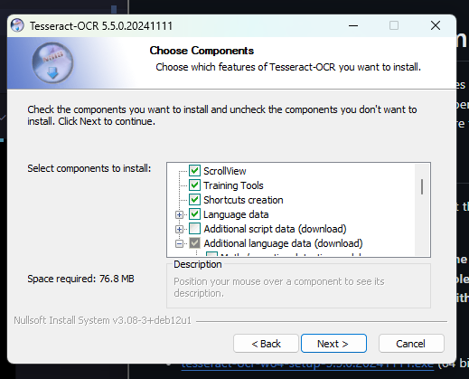
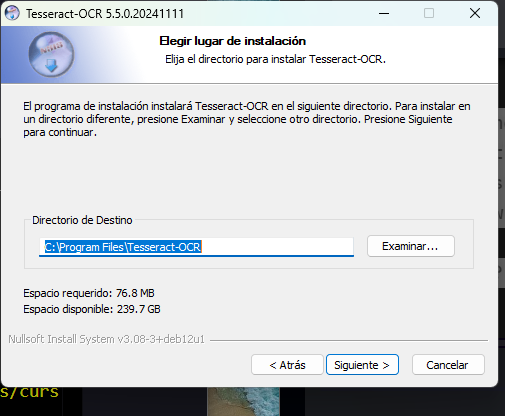

# Analista de Sentencias Ciudadanas

El proyecto de Análisis de Sentencias se compone principalmente de una aplicación de Python capaz de leer distintos tipos de archivos: PDF, Docx, md, txt y producir una Sentencia Ciudadana.

## Requisitos del sistema

- python-3.12.7
- docker (última version)
- Tesseract (última version https://github.com/UB-Mannheim/tesseract/wiki)

## Instalación

### Usuarios de Windows

Si eres un usuario de Windows, hay algunas cosas que tendrás que ejecutar de forma manual.

1. Instala WSL (Windows Subsystem for Linux)

   - Abre PowerShell como administrador y ejecuta:

     ```bash
     wsl --install
     ```

   - Sigue las instrucciones para instalar la última versión de Ubuntu.

2. Instala docker para Windows:

   - Descarga y ejecuta el instalador de docker desde [aquí](https://docs.docker.com/desktop/setup/install/windows-install/)

3. Instala python para Windows version 3.12.7

   - Descarga el instalador de python desde [aquí](https://www.python.org/downloads/release/python-3127/)

   - Ejecuta el instalador y sigue las instrucciones.
   - Asegúrate de marcar la opción "Add Python to PATH" (Agregar Python a PATH).

4. Instala tesseract para Windows

   - Descarga el instalador de tesseract desde [aquí](https://github.com/UB-Mannheim/tesseract/wiki)

   - Ejecuta el instalador y sigue las instrucciones.
   - Asegúrate de marcar la opción de "Aditional language data" (Datos adicionales de idioma).
   - Dentro de la opción "Additional language data" (Datos adicionales de idioma), asegúrate de seleccionar la opción "Spanish" (Español) para que el OCR funcione correctamente para el idioma español.

   

   - Copia el path de la instalación de tesseract.

   

   - Abre el archivo `.env` y agrega la siguiente línea:

     ```bash
     TESSERACT_CMD=PATH_DE_TESSERACT_COPIADO
     ```

## Configuración

Lo primero que debe hacer es copiar el archivo `.env.example` a `.env` y configurar las variables de entorno.

```bash
cp .env.example .env
```

Ahora, abre el archivo `.env` y configura las variables de entorno.

Como mínimo debes configurar las variables de entorno PROVIDER y MODEL.

```bash
PROVIDER=ollama
MODEL=llama3.1:8b
```

Acá https://ollama.com/library puedes encontrar una lista de modelos de IA disponibles para ejecutar con Ollama.

Además, debes configurar la variable de entorno `TESSERACT_CMD` con el path de la instalación de tesseract si estás en Windows.

```bash
TESSERACT_CMD=PATH_DE_TESSERACT_COPIADO
```

## Ejecución

1. Abre una terminal de Git Bash.
2. Ejecuta `./start.sh -m prod` para iniciar el servidor de producción.
